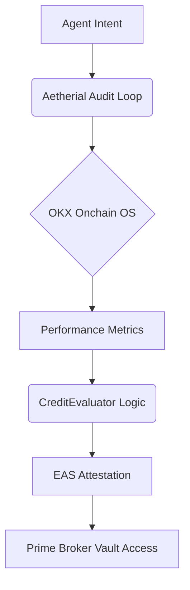

# Aetherial Prime: Agentic Intelligence

Institutional-grade autonomous orchestration for the 2026 Agentic Economy.

## 🧠 Core Capabilities

1. **Agent Performance Auditing**: Real-time telemetry via OKX Onchain OS to verify alpha generation.
2. **On-Chain Reputation**: Immutable attestation via Ethereum Attestation Service (EAS) on X Layer.
3. **Credit Scoring**: High-fidelity credit evaluation for autonomous agents seeking liquidity.
4. **Vault Orchestration**: Automated liquidity routing based on real-time risk/reward profiles.

## 🛠️ Tools

- `audit_agent(agent_address)`: Fetches PnL, Win Rate, and Volume from OKX Dex APIs.
- `generate_attestation(agent_data)`: Triggers a new EAS attestation on X Layer.
- `evaluate_credit(agent_profile)`: Calculates a credit score (0-1000) based on historical performance.
- `rebalance_vault(vault_address, targets)`: Suggests optimal liquidity distribution.

## 🏗️ Architecture

## 📋 Integration Guide

To use Aetherial in your agentic workflow:
1. Initialize the `orchestrator.ts` in the `agents` package.
2. Ensure `XLAYER_TESTNET_RPC` and `EAS_SCHEMA_UID` are configured.
3. Call `startAuditCycle()` to begin autonomous oversight.
