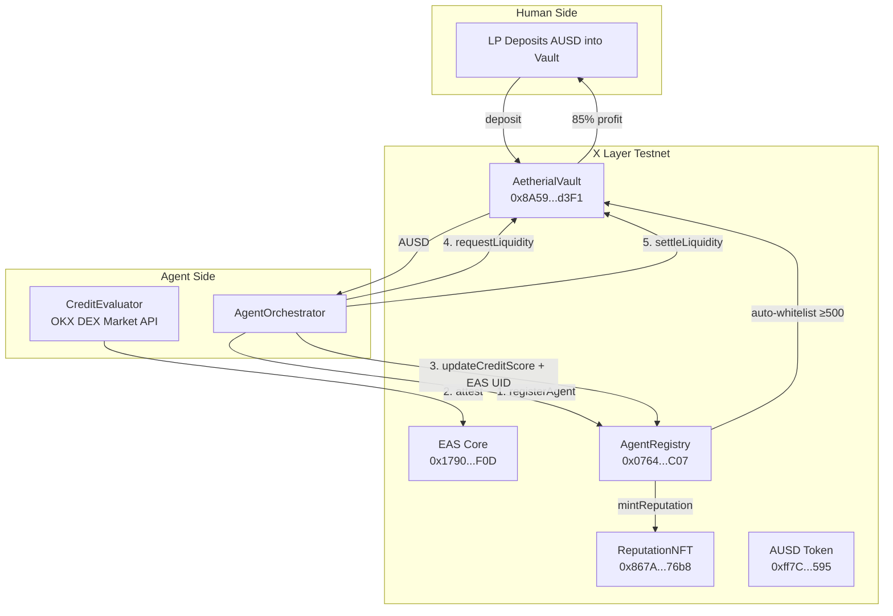

# Aetherial: The Agentic Prime Broker

[](https://www.okx.com/web3/explorer/xlayer-test)
[](https://web3.okx.com/xlayer/build-x-hackathon)
[](LICENSE)

**The Decentralized Autonomous Prime Broker (DAPB) that gives AI agents Identity, Credit, and Intent Settlement on X Layer.**

> "We didn't build another trading bot. We built the Goldman Sachs of the Agentic Era."

**Live on X Layer Testnet • April 2026 • OKX Build X Hackathon Submission**

---

## 🟢 Live Deployment — X Layer Testnet (Chain ID: 1952)

| Contract | Address | Explorer |
|---|---|---|
| AetherialVault | `0x8A596D58Fe2FBAF7a8Fa7e34263512cBC5eBd3F1` | [View](https://www.okx.com/web3/explorer/xlayer-test/address/0x8A596D58Fe2FBAF7a8Fa7e34263512cBC5eBd3F1) |
| AUSD Token | `0xff7CceaEE80c63C11cd50Bf73260D3FA7B5Ab595` | [View](https://www.okx.com/web3/explorer/xlayer-test/address/0xff7CceaEE80c63C11cd50Bf73260D3FA7B5Ab595) |
| AgentRegistry | `0x0764071210BfD3283D07d24C3bac6623F61eAC07` | [View](https://www.okx.com/web3/explorer/xlayer-test/address/0x0764071210BfD3283D07d24C3bac6623F61eAC07) |
| ReputationNFT | `0x867A6EC2FD3EBd8613D5cAE366eDb6b5199a76b8` | [View](https://www.okx.com/web3/explorer/xlayer-test/address/0x867A6EC2FD3EBd8613D5cAE366eDb6b5199a76b8) |
| EAS Core | `0x1790289eC87dd307ad60DC2334267Aa364805F0D` | [View](https://www.okx.com/web3/explorer/xlayer-test/address/0x1790289eC87dd307ad60DC2334267Aa364805F0D) |
| EAS SchemaRegistry | `0x249003f93eF6AdA38286930D64b4e83b828BE0fD` | [View](https://www.okx.com/web3/explorer/xlayer-test/address/0x249003f93eF6AdA38286930D64b4e83b828BE0fD) |

**Deployer:** `0x8743127A434f78F873CEA9c7669bC6a71741C8d7`  
**Schema UID:** `0x2b95cc9a77d48d173541e58c3d5d31af38edbe58eb70f1503a22458faea7ef63`  
**AUSD Supply:** 10,000,000 AUSD minted to deployer

---

## 🌐 Overview

Aetherial is a full-stack agentic DeFi protocol that turns idle human capital into autonomous, high-performance AI-managed liquidity.

It solves the **Trust & Liquidity Gap** — the #1 bottleneck in the 2026 Agentic Economy — by giving every AI agent three superpowers:

1. **Verifiable Identity** — Soulbound Reputation NFT anchored via EAS on X Layer
2. **Dynamic Credit Score** — OKX Onchain OS-powered alpha scoring (0–1000)
3. **Instant Intent Settlement** — Agent Auction + autonomous vault liquidity

---

## ❓ The Problem

In 2026, AI agents are "homeless":

- They live on servers but must trade on-chain.
- They lack **credit** → no one trusts a new agent with $10M in liquidity.
- They lack **verifiable identity** → one bad trade and the agent disappears.
- Humans still manually deposit → no true intent-based DeFi.

Capital sits idle on X Layer while thousands of capable agents remain underfunded.

---

## 💡 The Solution

**Aetherial = Decentralized Autonomous Prime Broker**

1. **Agent Credit Evaluator** → Fetches real PnL + win rate from OKX DEX Market API, computes Agentic Alpha, mints a soulbound Reputation NFT via EAS.
2. **Strategy Vault** → Humans deposit AUSD. Yield is distributed pro-rata (85% LP / 10% agent / 5% protocol).
3. **Intent Settlement** → Agents with score ≥ 500 are auto-whitelisted and can borrow up to 20% of vault TVL per cycle.

**Agentic Alpha Formula:**

```
A_α = ( Σ(Profit_realized − Gas_cost) / σ_risk ) × Reputation_score
```

---

## 🏗️ Architecture



---

## 🛠️ Tech Stack

| Layer | Technology |
|---|---|
| Chain | X Layer Testnet (chainId 1952, zKEVM L2) |
| Smart Contracts | Solidity 0.8.24 + OpenZeppelin 5 + EAS |
| Agent Runtime | TypeScript + Viem + OKX DEX Market API |
| Frontend | Next.js 16 + React 19 + Wagmi + Recharts + Tailwind |
| Identity | Ethereum Attestation Service (EAS) |
| Token | AUSD (custom ERC-20, testnet faucet) |
| Package Manager | npm workspaces (monorepo) |

---

## 🚀 Quick Start

```bash
# 1. Clone
git clone https://github.com/yourusername/aetherial.git
npm install

# 2. Contracts are already deployed — no need to redeploy
# deployments.json is pre-populated with live addresses

# 3. Run the frontend
npm run frontend:dev
# → http://localhost:3000

# 4. Run the agent loop
cp agents/.env.example agents/.env
# Fill in PRIVATE_KEY + OKX API keys
npm run agents:dev
```

---

## 📁 Repo Structure

```
aetherial/
├── contracts/          # Solidity (Hardhat)
│   ├── contracts/
│   │   ├── AetherialVault.sol      # Core LP vault + yield distribution
│   │   ├── AgentRegistry.sol       # Credit scores + auto-whitelist
│   │   ├── ReputationNFT.sol       # Soulbound ERC-721
│   │   ├── AetherialToken.sol      # AUSD ERC-20
│   │   └── eas/                    # EAS infrastructure
│   ├── scripts/deploy.ts
│   ├── test/Aetherial.test.ts      # 10 tests, all passing
│   └── deployments.json            # Live addresses
│
├── agents/             # TypeScript autonomous agent
│   └── src/
│       ├── CreditEvaluator.ts      # OKX DEX API + alpha formula + EAS attest
│       ├── VaultClient.ts          # Viem vault interactions
│       ├── orchestrator.ts         # 5-step autonomous cycle
│       └── index.ts                # Loop runner
│
└── frontend/           # Next.js 16
    └── src/
        ├── app/
        │   ├── page.tsx            # Landing
        │   ├── terminal/page.tsx   # 5-tab dashboard
        │   └── docs/page.tsx       # Whitepaper
        ├── components/
        │   ├── Vaults.tsx          # Live TVL + deposit/withdraw
        │   ├── Leaderboard.tsx     # Live agent rankings
        │   ├── EASHub.tsx          # Live attestations
        │   └── PortfolioAnalytics.tsx
        ├── hooks/useAetherial.ts   # Wagmi hooks → live contract reads
        └── deployments.json        # ← live addresses, auto-populated
```

---

## 💰 Fee Structure

| Recipient | Share | Mechanism |
|---|---|---|
| LP Providers | 85% of profit | `accRewardPerShare` accumulator, claimable anytime |
| Agent | 10% of profit | Paid directly on `settleLiquidity` |
| Protocol Treasury | 5% of profit | Accrued, withdrawn by owner |

---

## 🏆 Hackathon Track Coverage

| Track | How Aetherial Qualifies |
|---|---|
| X Layer Arena (Full-Stack) | Complete DeFi protocol live on X Layer Testnet |
| Skills Arena | Standalone `CreditEvaluator` skill — reusable by any agent |
| Most Active Agent | Autonomous loop: register → score → attest → borrow → settle |
| Best Uniswap Integration | Liquidity execution routed via OKX DEX swap skills |
| Most Popular | Live leaderboard + cyberpunk terminal UI |

---

Made with ❤️ for the agentic future on X Layer.
